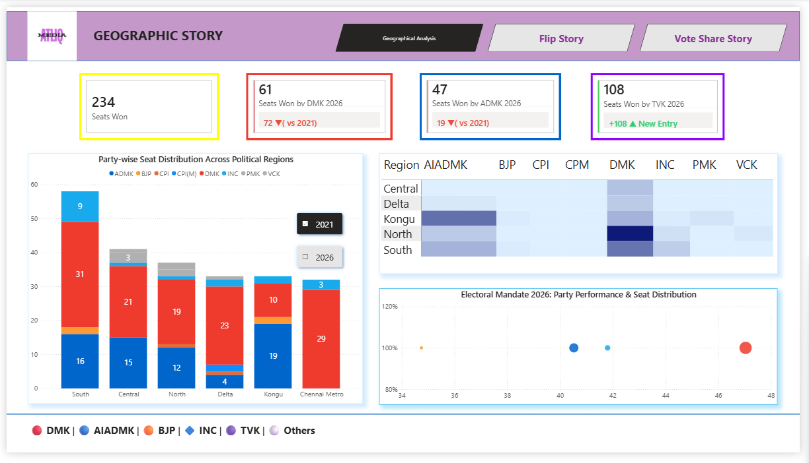
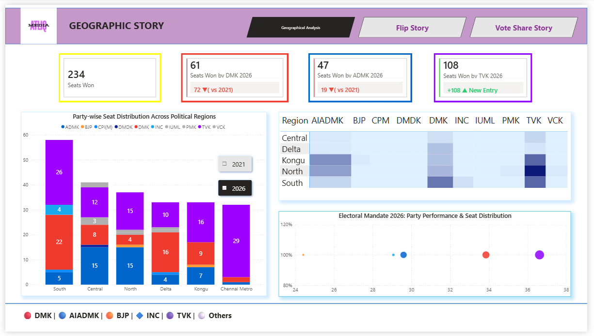
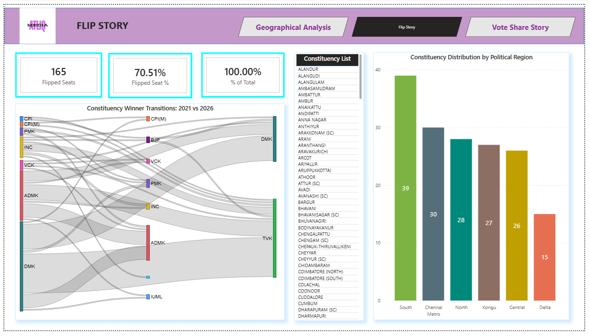
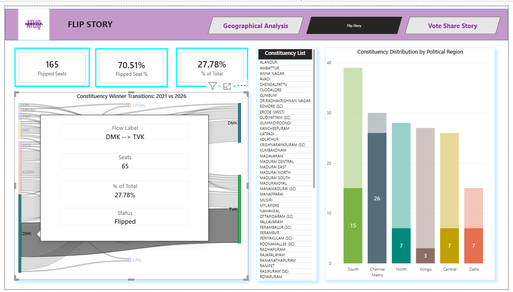
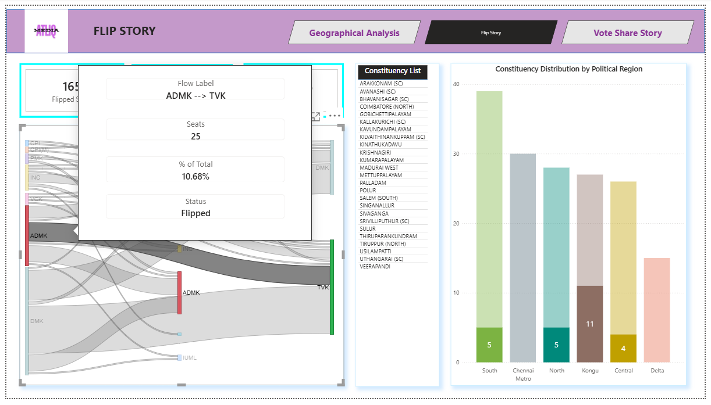
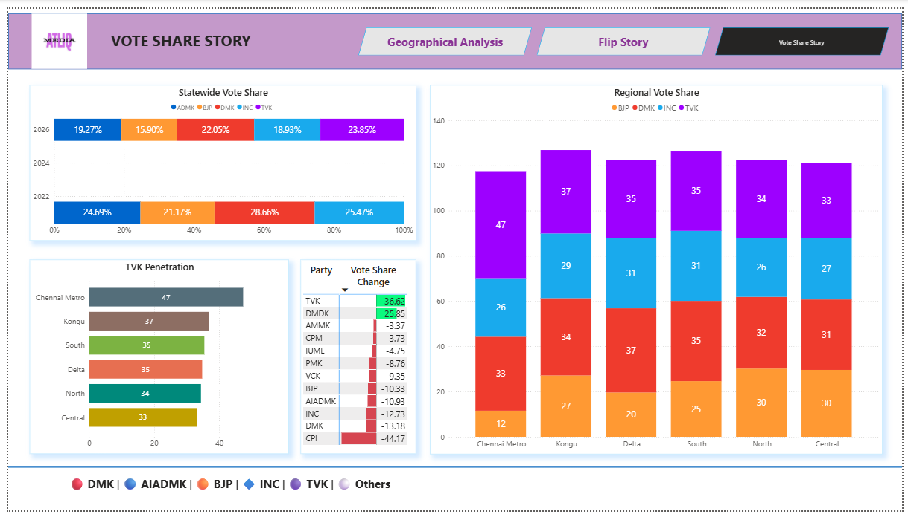

# Decoding 2026 Tamil Nadu Assembly Election : End-to-End Analytics & Data Pipeline

## 🚀 Project Overview
This project is an end-to-end, full-stack data analytics solution analyzing the historic structural shift in the **2026 Tamil Nadu Legislative Assembly Election**. Moving away from basic, pre-packaged data reporting, this portfolio project manages the entire data lifecycle: programmatically scraping raw unstructured tables, running advanced data-cleaning pipelines in SQL, engineering a dimensional model, and building an interactive 3-page Business Intelligence application in Power BI.

Using the **STAR method (Situation, Task, Action, Result)**, this documentation outlines how the project systematically uncovers the "What", "How", and "Why" behind the massive political disruption caused by a new political entrant (**TVK**) that fractured the state's traditional bipolar political landscape.


### 🧩 Domain: Media & Politics
### Function: Data Analytics
### Difficulty: Advanced 

End-to-End Power Analytics Project 

**Live Dashboard:** [Click here](https://app.powerbi.com/view?r=eyJrIjoiNDBjOGYwNDctYmFiZC00ZDZlLTkwZDEtOTdhNGRjYjE2ZTBjIiwidCI6ImM2ZTU0OWIzLTVmNDUtNDAzMi1hYWU5LWQ0MjQ0ZGM1YjJjNCJ9)

---

## 📌 Table of Contents
- <a href="#overview">Project Overview</a>
- <a href="#project-structure">Project Structure</a>
- <a href="#full-stack-architecture-and-data-pipeline">The Full Stack Architecture & Data Pipeline</a>
- <a href="#data-resource">Data Resource</a>
- <a href="#dataset-description">Dataset Description</a>
- <a href="#dimensional-model">Dimensional Model</a>
- <a href="#features-built">Features Built</a>
- <a href="#report-pages">Report Pages</a>
- <a href="#dashboard-preview">Dashboard Preview</a>
- <a href="#tech-stack-and-advanced-visualizations-implemented">Tech Stack & Advanced Visualizations Implemented</a>
- <a href="#key-analytical-pillars-and-insights">Key Analytical Pillars & Insights</a>
- <a href="#how-to-interact-with-this-project-locally">How to Interact with this Project Locally</a>
- <a href="#author--contact">Author & Contact</a>

---

## 🧾 Project Overview

AtliQ Media is a national news network making a one-hour TV show on the 2026 Tamil Nadu Assembly election results. Most channels will run heated debates and political commentary. AtliQ wants the opposite — a clean, simple, fact-based show that uses only public Election Commission of India (ECI) data.
AtliQ has hired you as a freelance data analyst. Your work will be the backbone of the show. The anchor will read from your slides. The on-screen graphics will come from your insights.
Your job: find the most interesting stories in the 2026 results, build clear charts for each story, and pitch them to AtliQ in a way that helps them plan the show.
You are not asked to explain why any party won or lost. You are not asked to predict what will happen next.
In 2026, AI can do most of the analysis for you. The real skill we are testing is storytelling: picking the right numbers, framing them so a regular viewer understands, and holding their attention without using complicated charts.


## Project Structure

```

tamilnadu-election-analysis-2026/
├── .gitignore               # Ignores large auto-generated recovery files
├── README.md                # The absolute focal point of your project
├── data/
│   ├── processed_voter_turnout.csv
│   └── regional_seat_matrix.csv
├── pbix/
│   └── TN_Election_2026_Analysis.pbix
└── visuals/
    ├── geographic_analysis.png
    ├── flip_story_sankey.png
    └── vote_share_trends.png
	
```

## 🛠️ The Full-Stack Architecture & Data Pipeline

```text
 [ Web Scraping ]              [ Data Engineering ]             [ Business Intelligence ]
   ECI Website     ┐
   IndiaVotes      ┴─► [ Python / Selenium ] ─► [ Raw CSVs ] ─► [ PostgreSQL / SQL Server ]
                                                                       │
 [ Data Presentation ]                                                 ▼ (CTEs, JOINs, Windows)
   Interactive Power BI ◄────────────────────────────────────── [ Star Schema Models ]
   
 1. Data Scraping & Ingestion (Python & Selenium)
The Challenge: Election data on official portals like the Election Commission of India (ECI) and repository sites like IndiaVotes are heavily buried under nested drop-downs, dynamic JavaScript frames, and paginated tables that prevent simple HTTP requests.

The Action: Built robust automation scripts using Python and Selenium WebDriver to programmatically interact with DOM elements, select regional filters, handle dynamic table rendering, and extract granular constituency-level metrics.

The Ingestion: The parsed data was structured, audited for basic schema integrity using Pandas, and exported into raw, pipeline-ready .csv staging files.

2. Data Cleaning & Transformation (SQL)
The Challenge: Raw political datasets are notoriously messy—featuring mismatched constituency names, inconsistent party acronyms (e.g., ADMK vs. AIADMK), missing fields, and unformatted numeric strings for vote margins.

The Action: Loaded the staging files into a relational database and executed advanced transformation queries using SQL:

CTEs (Common Table Expressions): Implemented modular CTEs to isolate, clean, and compute relative year-over-year shifts without polluting the baseline data.

Relational JOINs: Executed deep multi-table inner and left JOINs to map geographic constituency IDs smoothly against candidate and party dimensions.

Data Standardization: Applied string manipulation functions and window operations to handle NULL values and align standardized party classification codes.

The Architecture: Structurally transformed the flat files into a highly optimized database Star Schema, consisting of centralized Fact tables flanked by clean, relational Dimension tables (Geography, Time, and Parties).

```

## 🧩 Data Resource

•	ECI Results Portal (2026 TN Assembly): results.eci.gov.in/ResultAcGenMay2026. Constituency-wise results, candidates, votes, and turnout for the 2026 election.
•	ECI Statistical Reports: eci.gov.in/statistical-reports. Official PDF reports with detailed statistics for past elections, including 2021 TN Assembly.
•	Chief Electoral Officer, Tamil Nadu: elections.tn.gov.in. State-level data, Form 20 polling-station-level data, and constituency master lists.
•	Open Government Data Platform: data.gov.in (ECI section). Downloadable election datasets in CSV and Excel formats.
•	IndiaVotes: indiavotes.com. An independent database of Indian election results. Good for quick cross-checks across years.
•	Census 2011 boundary data: censusindia.gov.in. Use only for map boundaries. Do not make any demographic claims about voters.
•	Codebasics starter pack: three CSV files — tn_2021_results.csv, tn_2026_results.csv, and constituency_master.csv. Same schema. Ready to use.


## 🧩 Dataset Description

### The project is based on 5 CSV files:

•	constituency_master.csv - holds data for constituency, district, region, reserved
•	indiavotes.csv - party, seats, vote%
•	political_parties_2026_clean.csv – party, candidates contested, candidates won, candidates fd, votes polled, valid votes, in seats contested
•	TamilNadu_2021_Detailed Results.csv – state name, constituency number, constituency name, candidate name, gender, age, category, party, symbol, general, postal, total, %votes polled, total electors
•	TamilNadu_2026_Detailed Results.csv – serial no., constituency number, constituency name, total electors, candidate name, gender, age, category, party, symbol, general votes, postal votes, total votes, percent valid votes, percent total electors

### Dimensional model:

•	dim_party_master → fact_election_result_enriched (1:many)
•	YearTable → fact_election_result_enriched (1:many)
•	dim_election → fact_election_result_enriched (1:many)
•	dim_constituency → fact_election_result_enriched (1:many)
•	dim_party_master → fact_election_result (1:many)
•	YearTable → fact_election_result (1:many)
•	dim_election → fact_election_result (1:many)
•	dim_constituency → fact_election_result (1:many)
•	mart_constituency_flips → fact_election_result (1:many)
•	mart_constituency_flips → dim_constituency (1:1, cross filter direction)

## 💡 Features Built (KPIs & Visuals)

## Key Metrics:

•	Seats Won 
•	Seats Won by DMK 2026
•	Seats Won by ADMK 2026
•	Seats Won by TVK 2026
•	Flipped Seats 
•	Flipped Seat %
•	% of Total (Seat Share %)

## Filters:

•	Election Year : 2021, 2026

## 🖥 Report Pages

### Geographic Story

•	Party-wise Seat Distribution Across Political Regions (Stacked Column Chart)
•	Seats Won by Region and Party Heatmap
•	Electoral Mandate 2026: Party Performance & Seat Distribution (Scatter Plot)

### Flip Story

•	Constituency Winner Transitions: 2021 vs 2026 (Sankey Diagram)
•	Constituency List (Table) - inter dependent with Sankey
•	Constituency Distribution by Political Region (Stacked Column Chart)

### Vote Share Story

•	Statewide Vote Share (100% Stacked Bar Chart)
•	Regional Vote Share (Stacked Column Chart) 
•	TVK Penetration (Stacked Bard Chart)
•	Vote Share Changed for Each Party (Matrix) - interdependent with TVK Penetration

### 📷 Dashboard Preview 




### 🔎 Key Analytical Insights 
``` 
•	The Urban Wave vs. Rural Resistance: TVK’s victory is built on an aggressive urban/semi-urban wave (evident from Chennai Metro and South regions). However, traditional parties still hold deep roots in specific pockets (AIADMK in North and Central).
•	Vote Splitting Dynamics: The "Electoral Mandate" scatter plots at the bottom right indicate that vote shares have dramatically shifted. The consolidation of a large vote chunk around the 36%–37% mark for TVK means the threshold to win seats became much tighter, resulting in multi-cornered fights where lower vote percentages yielded victories.
•	Coalition Imperative: Because TVK is at 108 seats, they need 10 more seats to form a government. They are highly likely to court smaller regional parties, independents, or potentially look at an alliance of convenience with fractured elements of the existing system to cross the line.
```
Based on the provided election dashboard snapshots (which display comparative data between the 2021 and 2026 assembly elections for a 234-seat assembly, highly resembling Tamil Nadu's political landscape), here is an expert breakdown and interpretation of the data.
The two images show a toggle view: Image 1 highlights the 2021 historical data baseline, and Image 2 highlights the 2026 election results.
1. Executive Summary & Macro Trends
The 2026 election results show a massive, disruptive realignment in the state's political landscape, primarily driven by a powerful new political entrant.
•	Total Seats: 234 seats total (a simple majority requires 118 seats).
•	The Massive Disruption (TVK): TVK is a brand-new entry that completely shattered the traditional DMK-AIADMK duopoly. It won 108 seats, instantly becoming the single largest party in the assembly, though falling just short of an absolute majority (118).
•	The DMK Collapse: The incumbent DMK suffered a staggering loss, dropping from 133 seats in 2021 down to 61 seats in 2026 (a net loss of 72 seats).
•	The AIADMK Decline: ADMK / AIADMK also shrank significantly, dropping from 66 seats in 2021 to 47 seats in 2026 (a net loss of 19 seats).
•	A Hung Assembly: Since no single party or visible monolithic alliance cleared the 118-seat threshold, the data indicates a hung assembly where TVK will hold the primary leverage to form a coalition government.
2. Regional Breakdown & Shift Analysis
By tracking the stacked bar charts and heatmaps across both images, we can pinpoint exactly where this political earthquake took place.
A. Chennai Metro (Total: ~32 Seats)
•	2021 Status: Absolute DMK dominance. DMK won 29 seats, with minor allies picking up the rest.
•	2026 Reality: A near-total wipeout for the traditional parties. TVK won 29 seats here, completely capturing the urban capital region. DMK and others were reduced to single digits.
B. North Region (Total: ~38 Seats)
•	2021 Status: Highly contested, but heavily favored DMK (19 seats) and AIADMK (12 seats).
•	2026 Reality: TVK won 15 seats, cutting deeply into DMK’s share (which dropped to just 4 seats). Interestingly, AIADMK held completely firm here, retaining all 15 seats. The heatmap confirms North became a TVK-AIADMK battleground.
C. South Region (Total: ~58 Seats)
•	2021 Status: A strong stronghold for DMK, which held 31 seats, while AIADMK held 16.
•	2026 Reality: TVK captured 26 seats here. DMK fell to 22 seats, and AIADMK was relegated to a minor player with just 5 seats.
D. Kongu Region (Total: ~33 Seats)
•	2021 Status: Traditionally an AIADMK stronghold. In 2021, AIADMK won 19 seats, while DMK managed 10.
•	2026 Reality: TVK won 16 seats, completely fracturing the AIADMK fortress. AIADMK dropped drastically to 7 seats, while DMK held steady at 9 seats.
E. Central & Delta Regions
•	Central: AIADMK held perfectly flat at 15 seats across both elections. DMK collapsed from 21 seats to just 8, while TVK absorbed the difference by winning 12 seats.
•	Delta: DMK dropped from 23 to 16 seats. AIADMK dropped from 4 to 0. TVK won 10 seats, and smaller parties like DMDK/others made minor cameos.






### 🔎 Key Analytical Insights 
``` 
•	TVK is Built on Disaffected DMK Voters: While TVK took seats from everyone, its primary engine of growth was consuming the DMK's 2021 urban coalition. For every 1 seat TVK took from ADMK, it took more than 2.5 seats from DMK.
•	The Core Stronghold Survival: Look closely at the background flows in image_02a319.png. Notice the thick, uninterrupted lines of voters staying with DMK and ADMK, alongside some minor flips (like INC or VCK voters moving around). This proves that while TVK completely disrupted the state, it did not entirely dissolve the core foundational party bases—it just disproportionately won the swinging, anti-incumbent majority.
```
Based on the provided dashboards focusing on the "Flip Story" between the 2021 and 2026 assembly elections, we can run a deep diagnostic on constituency transitions. This data isolates the specific seats that changed hands (flipped) to show exactly how the political landscape fractured.
The three images provide an overview and then drill down into specific transitions: image_02a3d3.png shows the holistic flip view, image_02a39b.png filters for the DMK $\rightarrow$ TVK flip, and image_02a319.png filters for the ADMK $\rightarrow$ TVK flip.
1. Executive Summary & Anti-Incumbency Metrics
The 2026 election saw an absolute tidal wave of anti-incumbency and voter volatility.
•	The Volatility Index: Out of 234 total assembly seats, an astonishing 165 seats flipped to a different party compared to 2021.
•	The Flip Rate: This translates to a 70.51% Flipped Seat %. Seven out of ten sitting constituencies rejected their incumbent party, an incredibly high rate of turnover that signals deep public appetite for political realignment.
2. Where Did the Flips Happen? (Regional Analysis)
The bar chart, "Constituency Distribution by Political Region," shows where the 165 flipped seats were geographically located:
•	South Region: Experienced the highest volume of change with 39 flipped seats.
•	Chennai Metro: Saw 30 seats flip. Given that Chennai Metro has roughly 32 seats total, this means nearly the entire capital region completely uprooted its 2021 mandate.
•	North, Kongu, and Central Regions: Experienced massive disruptions as well, accounting for 28, 27, and 26 flipped seats respectively.
•	Delta Region: Saw the lowest volume of seat turnover with 15 flipped seats.
3. Deep-Dive: The TVK Takeover Vectors
By utilizing the Sankey diagrams (Winner Transitions) from image_02a39b.png and image_02a319.png, we can map precisely where the new entrant, TVK, pulled its historic 108-seat haul from.
       [2021 Base]                          [2026 Result]
       ┌─────────┐       65 Seats Flipped   ┌───────────┐
       │   DMK   │ ───────────────────────> │    TVK    │
       └─────────┘                          └───────────┘
       ┌─────────┐       25 Seats Flipped   ┌───────────┐
       │  ADMK   │ ───────────────────────> │    TVK    │
       └─────────┘                          └───────────┘
Vector A: The DMK to TVK Bleed (The Primary Catalyst)
As highlighted by the tooltips in image_02a39b.png:
•	Seat Count: 65 seats flipped directly from DMK $\rightarrow$ TVK.
•	Impact Share: This single transition accounts for 27.78% of all seats in the entire assembly.
•	Regional Breakdown: Out of these 65 seats, the urban/semi-urban hubs collapsed entirely into TVK's hands: 26 were in Chennai Metro and 15 were in the South. The remaining seats came from the North (7), Central (7), Delta (7), and Kongu (3).
Vector B: The ADMK to TVK Bleed (The Secondary Catalyst)
As highlighted in image_02a319.png:
•	Seat Count: 25 seats flipped directly from ADMK $\rightarrow$ TVK.
•	Impact Share: This transition made up 10.68% of the total assembly.
•	Regional Breakdown: TVK cracked open the traditional ADMK strongholds here. 11 of these seats came straight out of the Western Kongu belt. The rest came from the North (5), South (5), and Central (4) regions. Zero seats came from Chennai Metro or Delta for this specific flow.




### 🔎 Key Analytical Insights 
```
•	Efficiency of the Vote: TVK's 23.85% statewide vote share yielded 108 seats, meaning their vote was incredibly geographically efficient—especially in urban pockets like Chennai where their numbers spiked to 47%.
•	The Multi-Cornered Trap: With four major factions holding between 15% and 24% of the statewide vote (TVK, DMK, AIADMK, INC, and BJP), the threshold needed to win a constituency under the first-past-the-post system dropped significantly. This explains why a party with just ~34% regional vote share could trigger a massive seat sweep.
```
Based on the provided dashboard snapshot titled "Vote Share Story" in image_029c18.png, we can perform a comprehensive data exploration and analysis of the underlying popular vote mechanics that powered the 2026 election results.
This view shows how political support shifted globally and regionally, shifting focus away from raw seat counts to actual voter percentages.
1. Statewide Vote Share Analysis (2022 vs. 2026)
The "Statewide Vote Share" chart tracks how the total voter pie fractured over the election cycle.
•	TVK (The New Dominant Force): TVK captured the largest slice of the electorate in 2026 with 23.85% of the statewide vote share.
•	The DMK Meltdown: DMK's statewide vote share contracted severely, dropping from 28.66% in 2022 down to 22.05% in 2026. Despite dropping behind TVK in popular support, they retained enough concentrated voter blocks to win 61 seats.
•	AIADMK & INC Declines: Both traditional giants shrunk in overall share. AIADMK fell from 24.69% to 19.27%, while INC slid from 25.47% down to 18.93%.
•	BJP Contraction: The BJP also saw its statewide popular footstep shrink, moving from 21.17% in 2022 to 15.90% in 2026.
2. Vote Share Change: The Gainers vs. Losers
The "Vote Share Change" table quantifies the absolute percentage swings for each party, confirming a massive consolidation toward two main disruptors.
•	The Big Gainers: TVK (+36.62) and DMDK (+25.85) registered massive growth metrics, showing that voters actively broke away from old alignments.
•	The Traditional Block Bleed: Every single major established party faced negative vote share growth.
o	CPI: -44.17 (The largest crash in structural support)
o	DMK: -13.18
o	INC: -12.73
o	AIADMK: -10.93
o	BJP: -10.33
o	Lesser regional allies like VCK (-9.35) and PMK (-8.76) were similarly squeezed out.
3. Regional Vote Share & TVK Penetration
The "TVK Penetration" horizontal chart paired with the "Regional Vote Share" stacked bar chart reveals exactly how TVK localized its strength.
A. Chennai Metro (The Epicenter)
•	TVK Penetration: 47%
•	Analysis: TVK captured an outright near-majority of all votes cast in Chennai Metro. This overwhelming concentration explains why they were able to completely sweep 29 out of the region's seats. DMK was a distant second here with 33%, while BJP (12%) and INC (26%) lagged far behind.
B. Kongu (The Western Front)
•	TVK Penetration: 37%
•	Analysis: Kongu shows a highly competitive three-pronged layout. TVK led with 37%, but DMK held onto 34% and BJP secured 27%, leading to highly fragmented local margins.
C. Delta & South Regions
•	TVK Penetration: 35% in both regions.
•	Analysis: In Delta, DMK actually maintained a higher popular vote share (37%) than TVK (35%), which explains why DMK managed to retain 16 seats there. In the South, DMK (35%) and TVK (35%) tied perfectly in popular vote share, turning the region into a volatile battleground.
D. North & Central Regions (The Resistance)
•	TVK Penetration: 34% (North) and 33% (Central)
•	Analysis: These regions represent TVK’s lowest relative penetration levels. In North and Central, the combined vote shares of the traditional alliances (such as BJP holding 30% in both and DMK maintaining 32% and 31%) kept TVK from running away with unmitigated majorities, aligning with AIADMK's seat resilience there.


## 🛠 Tech Stack 

•	Python - Web Scrapping and Data Exploration
•	MySQL - Data Cleaning and Transformation
•	Power BI - Data Visualization

## 💡 Key Analytical Pillars & Insights

**Pillar 1: The Volatility Index (Tipping Point Analysis)**
This pillar measures the friction and stability of the electorate. Instead of just looking at who won, it quantifies the rate of rejection of sitting representatives.

**The Metric:** The **70.51% Flipped Seat %** (image_02a3d3.png).

**Insight:** A flip rate this high indicates systemic voter exhaustion with the status quo, rather than a standard, localized swing. When 7 out of 10 seats change hands, historical incumbency models become completely obsolete for predictive modeling.

**Pillar 2: Geographic Efficiency (The Concentration Advantage)**
This pillar analyzes the mathematical relationship between popular vote yield and regional seat acquisition. It answers how a party can maximize its return on investment (ROI) on votes.

**The Metric:** TVK's **47% Vote Share in Chennai Metro** yielding a **90%+ seat sweep** (image_029c18.png vs image_02a39b.png).

**Insight:** TVK achieved an incredibly high "Vote-to-Seat Conversion Ratio." By hyper-concentrating their resources into high-density urban corridors (Chennai Metro and the South) rather than spreading themselves thin statewide, they turned a modest 23.85% statewide popular vote into a dominant 108-seat plurality.

**Pillar 3: Cohort Cannibalization (Asymmetric Bleeding)**
This pillar maps out the exact donor-recipient pathways using flow metrics (Sankey data) to see which legacy brand's consumer base was stolen.

**The Metric: 65 seats** flipping **DMK → TVK** vs. **25 seats** flipping **ADMK → TVK** (image_02a39b.png & image_02a319.png).

**Insight:** The disruption was structurally asymmetric. TVK didn't pull equally from the duopoly; it acted as a direct substitute for the incumbent DMK. For every 1 seat TVK took from the opposition (ADMK), it cannibalized 2.6 seats from the ruling party (DMK), indicating that TVK successfully captured the anti-incumbent "change" cohort.

**Pillar 4: Vote-to-Seat Elasticity in Multi-Cornered Fractures**
This pillar evaluates the behavior of a fragmented political landscape under a First-Past-The-Post (FPTP) framework.

**The Metric:** Five political blocks pulling between **15% and 24%** of the statewide popular vote (image_029c18.png).

**Insight:** When the vote share drops into a tight, multi-cornered band, the "plurality threshold" required to win a seat drastically drops. In 2021, a candidate might have needed 45% of a local vote to win; in 2026, due to intense vote-splitting among DMK, AIADMK, BJP, and INC, TVK was able to win seats with a much lower mathematical floor (around 33%–35% in regions like Kongu and Delta).

**💡 Top 3 Data Insights for Your Presentation**
**📌 Insight 1: Urban Centers act as Political Early Adopters**
The data shows that the political disruption did not move uniformly. It started as an explosive wave in the urban capital (Chennai Metro: 47% vote share, 29 seats) and rippled outward into the semi-urban South (35% vote share). The deep rural segments (Central/North) acted as "laggards," showing massive resistance where legacy party machinery (like AIADMK's ground game) held flat at 15 seats.

**📌 Insight 2: The Fallacy of the Popular Vote**
If you only looked at the statewide popular vote change table (image_029c18.png), you would think DMK (−13.18%) and INC (−12.73%) suffered identical fates. However, cross-referencing this with seat charts reveals that DMK's vote remained tightly packed enough to salvage 61 seats, whereas the INC's vote was completely diluted, causing their seat efficiency to collapse.

**📌 Insight 3: The Coalition Imperative Matrix**
With TVK sitting at 108 seats (10 short of a majority) and the DMK-led block sitting fragmented, the dashboard maps the path to power. TVK does not need a mega-alliance; by targeting and converting just 10% of the minor, highly squeezed-out independent/ally blocks (like DMDK or others who saw minor seat/vote blips), they can form a highly stable coalition without compromising their core brand identity.

## 🛠️ Tech Stack & Advanced Visualizations Implemented
* **BI Platform:** Microsoft Power BI Desktop
* **Advanced Data Modeling:** Native Power BI Star Schema architecture with DAX measures for dynamic % of total seat distributions.
* **Sankey Flow Chart:** Implemented via advanced custom marketplace visuals to track asymmetric seat transitions.
* **Scatter Optimization Matrix:** Developed to map absolute Vote Share (%) against Seat Share (%) to gauge electoral efficiency.

## 📦 How to Interact with this Project Locally
1. Clone the repository: `git clone https://github.com/YOUR_USERNAME/tamilnadu-election-analysis-2026.git`
2. Open the `/pbix/TN_Election_2026_Analysis.pbix` file using Microsoft Power BI Desktop.
3. Use the contextual canvas buttons to fluidly cycle through the **Geographical Analysis**, **Flip Story**, and **Vote Share Story**.

## Author & Contact

**Rita Mahato**  

Data Analyst 

📧 Email: ds.rita.mahato@gmail.com  

🔗 [LinkedIn](https://www.linkedin.com/in/mahato-rita/)  
